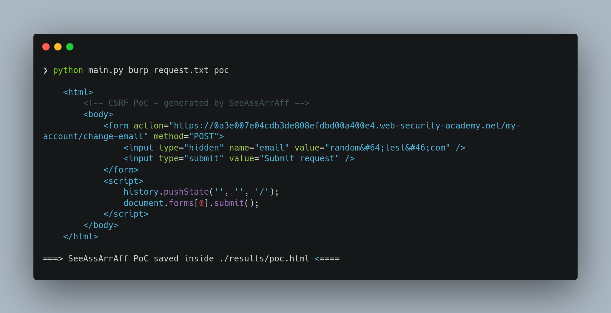

# SeeAssArrAff

A Cross-Site Request Forgery (CSRF) Proof of Concept (PoC) generator. 

## Usage

1. Copy the request from Burp and add it inside any file
2. Pass the input file as the first argument and an output as the second
3. The results will be available inside results/<output_file>.html

```
python main.py burp_request.txt poc
```



## To Do's:
- [x] HTTP Simple Request Handling
- [x] JSON Request Handling with Padding
- [ ] Multipart Requests
- [x] Requests without a body
- [ ] CSRF Validation by repeating the request
